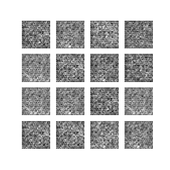
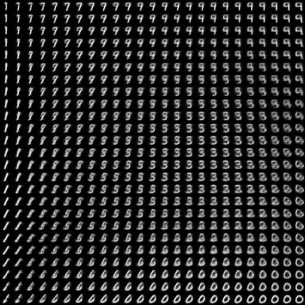

# Convolutional Variational Autoencoder

Convolutional Variational Autoencoder (VAE) for a probalistic approach to latent-space representation.
We attempt to map the input data to the parameters of a probability distribution (such as a Guassian), and as a result we can produce a continuous, structured latent space.

We build our VAE by first defining an encoder and decorder architecture, which are 2-3 layer CNNs with ReLU activations. We apply a reparameterization trick to enable backpropogation through the bottleneck, which became a random sampling operation due to the VAE architecture.

As the VAE trains, its generated images more closely resemble the input images and become sharper. Below is a visualization of the VAE's generated digits as it improves during training:

2D manifold of the digits from the latent space:

### References
[Variational Autoencoder for Deep Learning of Images, Labels and Captions](https://arxiv.org/abs/1609.08976)
